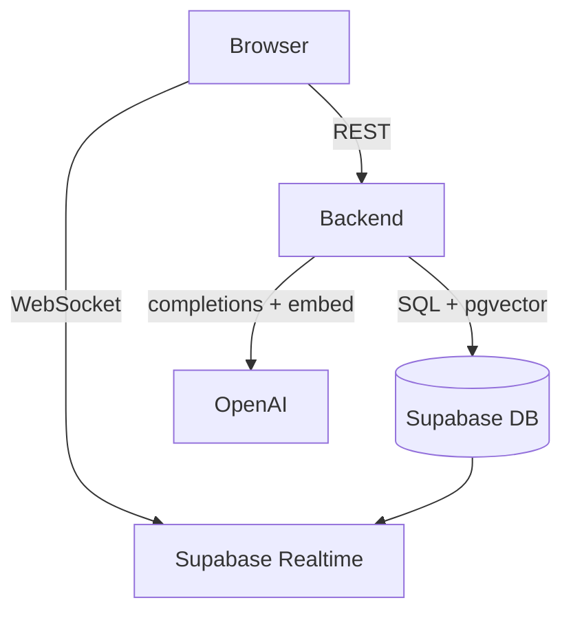
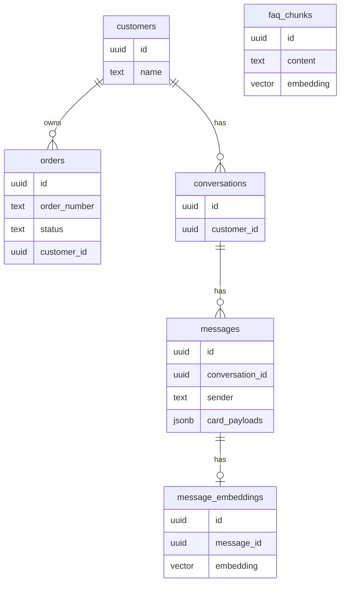
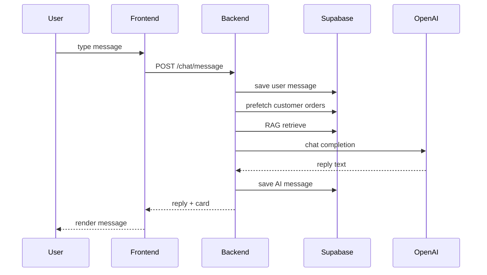
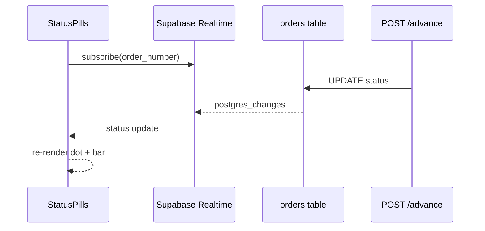
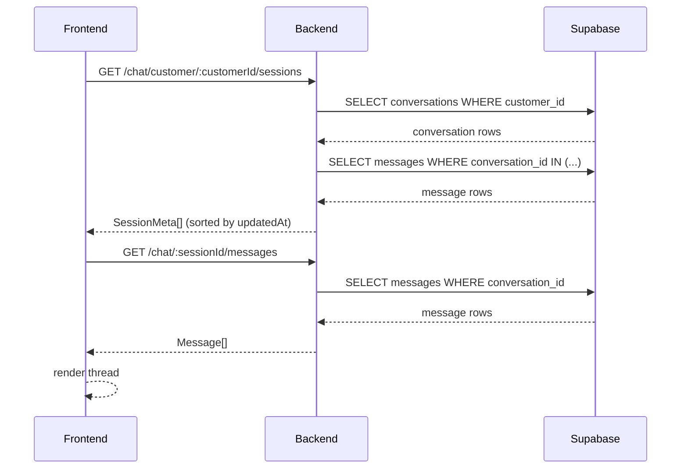

# Marqet AI Chat — Architecture

---

## 1. Project Summary

This project is a mini AI customer support chat widget where the AI agent represents **Marqet** — a curated Indian e-commerce marketplace — answering questions about products, policies, and orders via a RAG-powered LLM pipeline backed by OpenAI. Users chat in a live widget, can track mock orders (MQ-XXXX format) in real time via Supabase Realtime, and have their full conversation history persisted and restored on reload. The backend is a clean Express + TypeScript REST API with layered separation between routes, services, and data; the frontend is React + Vite + Tailwind.

---

## 2. System Overview

**Browser** (React + Vite)
- Chat UI sends REST requests to the backend
- Supabase Realtime client subscribes to order status changes via WebSocket

**Backend** (Express + TypeScript)
- Middleware → Routes → Services → Data Layer
- Calls Supabase for all DB reads/writes and pgvector similarity search
- Calls OpenAI for chat completions and message embeddings

**Supabase** (PostgreSQL + pgvector + Realtime)
- 6 tables: conversations, messages, orders, faq_chunks, message_embeddings, customers
- Realtime publication on orders table pushes UPDATE events to subscribed clients

**OpenAI**
- `gpt-4o-mini` for chat completions
- `text-embedding-3-small` (1536 dims) for FAQ and message embeddings



---

## 3. Frontend Components

```
App.tsx
└── FloatingChatBubble (draggable, snaps to corner)
    └── ChatWidget (440×680)
        ├── ChatHeader (title + UserSwitcher + controls)
        │   └── UserSwitcher (5 mock customers, fixed-pos dropdown)
        ├── MessageList (scrollable)
        │   └── MessageBubble (multi-card, retry on failure)
        │       └── OrderCard (structured order reply)
        │           └── StatusPills (live Realtime updates)
        ├── TypingIndicator (animated dots)
        ├── MessageInput (textarea + send)
        └── SessionSwitcher (session list, × delete)
```

**State and API:**

| Module | Responsibility |
|---|---|
| `chatStore` | messages, sessions, delete session, sends customerId (UUID) per turn |
| `customerStore` | active customer, persisted as `marqet_active_customer` |
| `uiStore` | `isWidgetOpen` toggle |
| `api/chat.ts` | typed fetch wrapper for all backend endpoints |
| `lib/supabase.ts` | Supabase JS client for Realtime subscriptions |

---

## 4. Backend Layer Architecture

```
Middleware
├── requestLogger.ts — attaches 8-char request ID; logs all pipeline stages as [req:xxx stage]
├── identity.ts      — async UUID resolver: customerId body/header → full CustomerRow on req
├── validate.ts      — Zod input validation (message, customerId, customerName, orderNumber)
├── adminAuth.ts     — DEMO_ADMIN_KEY guard on POST /orders/:num/advance
├── errorHandler.ts  — global error formatter (LLMError → 502, DBError → 503)
└── cors()           — allows all localhost:* in dev, env var in prod

Routes
├── chat.routes.ts  — POST /chat/message, GET /chat/customer/:id/sessions, GET /chat/:id/messages, DELETE /chat/:id
└── order.routes.ts — GET /orders/:num, POST /orders/:num/advance

Services
├── chat.service.ts  — session + message orchestration, order intent detection, RAG
├── rag.service.ts   — embed + retrieve context (dual stores)
├── order.service.ts — order lookup + status advance
└── llm.service.ts   — generateReply(), system prompt builder

Data Layer
├── db/queries.ts    — typed Supabase access functions
├── vector/search.ts — pgvector cosine similarity search
└── db/supabase.ts   — Supabase client init
```

---

## 5. Database Schema

| Table | Key columns |
|---|---|
| `conversations` | `id` (PK uuid), `created_at`, `customer_id` (FK → customers) |
| `messages` | `id` (PK uuid), `conversation_id` (FK), `sender`, `text`, `card_payload` jsonb, `card_payloads` jsonb, `timestamp` |
| `orders` | `id` (PK uuid), `order_number` (user-facing, e.g. MQ-1001), `status`, `customer_name`, `customer_id` (FK → customers), `items` jsonb, `updated_at` |
| `faq_chunks` | `id` (PK uuid), `content`, `embedding` vector(1536), `metadata` jsonb |
| `message_embeddings` | `id` (PK uuid), `message_id` (FK), `embedding` vector(1536) |
| `customers` | `id` (PK uuid), `name`, `created_at` |

**Relationships:**
- `customers` → `orders` (one-to-many via `customer_id`)
- `customers` → `conversations` (one-to-many via `customer_id`)
- `conversations` → `messages` (one-to-many via `conversation_id`)
- `messages` → `message_embeddings` (one-to-one via `message_id`)

**Order identifier convention:**
- `order_number` — user-facing identifier (MQ-XXXX); used in chat detection, URL params, Realtime filters, and all customer-visible context
- `id` — internal UUID primary key; used only for FK joins and DB-level deletes; never shown to users



---

## 6. Data Flow: Send Message + RAG

1. User types a message → frontend validates → `POST /chat/message { message, sessionId, customerId }` (UUID from `customers.id`; backend resolves to full name server-side)
2. Backend resolves or creates conversation row
3. User message saved to DB; embedding stored async (fire-and-forget)
4. Customer's full order list pre-fetched once (`ORDERS_FOR_CUSTOMER` grounding context built)
5. Order intent detection:
   - "my orders" phrase → reuses pre-fetched list → injects `MY_ORDERS_FOUND` context
   - Single `MQ-XXXX` ref → `getOrderByNumber` → `customerOwns()` check → injects `ORDER_FOUND` or `ORDER_BELONGS_TO_OTHER`
   - Multiple `MQ-XXXX` refs → parallel lookups → ownership filter → injects `MULTIPLE_ORDERS_FOUND`
6. RAG retrieval: embed user message → top-3 from `faq_chunks` + top-3 from `message_embeddings` (scoped to conversation)
7. Build system prompt with RAG context + order context + `ACTIVE_CUSTOMER` + `ORDERS_FOR_CUSTOMER`
8. `gpt-4o-mini` chat completion → reply text
9. AI message saved to DB (with `card_payload` and `card_payloads` for multi-card restore)
10. Response: `{ reply, sessionId, card?, card_payloads? }` → frontend renders reply and order cards



---

## 7. Data Flow: Real-time Order Tracking

1. `OrderCard` mounts → `StatusPills` creates a Supabase Realtime channel (UUID-suffixed to avoid collision)
2. Channel subscribes to `postgres_changes` on `orders` filtered by `order_number`
3. Demo: `POST /orders/:num/advance` updates the order status in Supabase
4. Supabase sends UPDATE event to all subscribed channel instances
5. `StatusPills` receives event → updates status state → dot color and progress bar update immediately



---

## 8. Data Flow: Page Load / Session Discovery

Sessions are backed by Supabase and recovered server-side on every load, so history is available in any browser or incognito window without a separate auth layer.

**On `chatStore.initStore()` (app mount) and `switchCustomer()` (customer switch):**

1. Call `GET /chat/customer/:customerId/sessions` → backend queries `conversations WHERE customer_id = :id` + joins first user message and MAX(message timestamp) per conversation in two SQL queries → returns `SessionMeta[]` sorted by `updatedAt DESC`
2. Sync the returned list to `marqet_sessions_<customerId>` in localStorage (cache for offline fallback)
3. If the backend is unreachable, fall back to the localStorage cache
4. Resolve the session to resume:
   - If `marqet_active_session_<customerId>` is set and the session exists in the server list → restore it
   - If no stored active session but sessions exist → auto-resume the most recent one (sessions[0])
   - If no sessions → show empty chat, wait for first message
5. `GET /chat/:sessionId/messages` → render full thread including all order cards (restored from `card_payloads` DB column)



---

## 9. Error Handling

| Layer | Error class | HTTP response |
|---|---|---|
| Rate limit exceeded | express-rate-limit | `429` with plain-text "Too many requests" message |
| Input validation | Zod parse failure | `400` with field-level message |
| LLM call | `LLMError` (rate_limit / invalid_key / timeout / server_error) | `502` LLM unavailable |
| DB call | `DBError` (any Supabase error) | `503` DB unavailable |
| Unhandled | `Error` | `500` Server error |

Frontend shows inline error banners and a "Retry" button on failed messages. Network errors (fetch failure) surface as "Network error — check your connection."

---

## 10. Anti-Hallucination and Privacy

Three independent guardrails prevent the LLM from fabricating or leaking order data:

**Customer privacy (`customerOwns()`):**
Every order lookup in `chat.service.ts` runs a name comparison before injecting context. If the order belongs to a different customer, `ORDER_BELONGS_TO_OTHER` context is injected and the system prompt rule refuses to reveal any details — not the status, not the items, not even whether the order exists.

**Identity lock (`detectIdentityClaim()`):**
Patterns like "my name is X", "I am X", "I'm X", "this is X", "call me X" are detected on every message. If the claimed name does not match `ACTIVE_CUSTOMER`, an `IDENTITY_CONFLICT` context block is injected and a system prompt rule prevents the LLM from accepting the new identity. The session identity is always the one set at session start.

**Order-list grounding (`ORDERS_FOR_CUSTOMER`):**
The customer's actual orders are pre-fetched once per turn and serialised into context (order number, items, status). A system prompt rule instructs the LLM: if the user claims to have ordered something not in this list, do not say "I couldn't find that order" — instead respond with the actual order list. This prevents the LLM from confirming orders that never existed.

---

## 11. Folder Structure

```
marqet-ai-chat/
├── ARCHITECTURE.md
├── README.md
│
├── backend/
│   ├── src/
│   │   ├── __tests__/
│   │   │   ├── customerIdentity.test.ts  ← name-based ownership + detectIdentityClaim + ORDER_RE (20 tests)
│   │   │   ├── identityFlow.test.ts      ← ACTIVE_CUSTOMER context, UUID ownership regression
│   │   │   ├── ownership.test.ts         ← UUID ownership, name fallback, partial UUID (12 tests)
│   │   │   └── systemPrompt.test.ts      ← escalation contact + structural invariants (10 tests)
│   │   ├── types/
│   │   │   ├── database.ts           ← generated Supabase DB types
│   │   │   └── index.ts              ← shared TS types + error classes
│   │   ├── db/
│   │   │   ├── queries.ts            ← typed DB access functions
│   │   │   └── supabase.ts           ← Supabase client init
│   │   ├── lib/
│   │   │   ├── chatHelpers.ts        ← pure helpers: customerOwns, detectIdentityClaim, ORDER_RE
│   │   │   ├── constants.ts          ← LLM, RAG, LIMITS, CONTEXT_TAGS (single source of truth)
│   │   │   └── logger.ts             ← structured JSON logger (prod) / tagged strings (dev)
│   │   ├── vector/
│   │   │   ├── embed.ts              ← OpenAI embedding wrapper
│   │   │   └── search.ts             ← pgvector cosine similarity search
│   │   ├── services/
│   │   │   ├── chat.service.ts       ← session + message orchestration
│   │   │   ├── rag.service.ts        ← embed + retrieve context (dual stores)
│   │   │   ├── order.service.ts      ← order lookup + status advance
│   │   │   └── llm.service.ts        ← generateReply(), system prompt builder
│   │   ├── routes/
│   │   │   ├── chat.routes.ts        ← POST /chat/message, GET /chat/customer/:id/sessions, GET/DELETE /chat/:id
│   │   │   └── order.routes.ts       ← GET + POST /orders/:num
│   │   ├── middleware/
│   │   │   ├── adminAuth.ts          ← DEMO_ADMIN_KEY guard on /orders/:num/advance
│   │   │   ├── errorHandler.ts       ← global error formatter (LLMError → 502, DBError → 503)
│   │   │   ├── identity.ts           ← async UUID resolver: body/header customerId → req.activeCustomer
│   │   │   ├── requestLogger.ts      ← attaches [req:xxxxxxxx] trace ID to all pipeline log lines
│   │   │   └── validate.ts           ← Zod input validation (message, customerId UUID, customerName)
│   │   ├── prompts/
│   │   │   └── system.ts             ← system prompt + RAG injector + escalation contact
│   │   ├── seed/
│   │   │   ├── customers.ts          ← 5 demo customers seeded at startup
│   │   │   ├── faq.ts                ← Marqet FAQ chunks + embeddings (38 chunks)
│   │   │   ├── faqData.ts            ← raw FAQ text content
│   │   │   └── orders.ts             ← 7 mock orders across 5 customers (MQ-1001–MQ-1007)
│   │   ├── app.ts                    ← Express setup + rate limiting + middleware chain
│   │   └── server.ts                 ← entry point, DB init, seed check
│   ├── supabase/
│   │   └── migrations/
│   │       ├── 001_init.sql                          ← 5 core tables + pgvector extension
│   │       ├── 002_vector_search_functions.sql
│   │       ├── 003_session_isolated_embeddings.sql
│   │       ├── 004_marqet_status_rename.sql
│   │       ├── 005_fix_order_customer_mapping.sql
│   │       ├── 006_add_card_payloads_column.sql
│   │       ├── 007_add_customers_table.sql           ← customers table + FK backfill
│   │       ├── 008_embedding_not_null_and_indexes.sql ← NOT NULL on embeddings + indexes
│   │       ├── 009_customer_slug.sql                 ← slug column (lower first name) + unique index
│   │       └── 010_remove_slug_use_uuid.sql          ← drop slug column; drop unique constraint on name
│   ├── .env.example
│   ├── package.json
│   └── tsconfig.json
│
└── frontend/
    ├── src/
    │   ├── data/
    │   │   └── customers.ts          ← 5 mock customer profiles
    │   ├── components/
    │   │   ├── FloatingChatBubble.tsx ← draggable bubble + snap-to-corner
    │   │   ├── UserSwitcher.tsx       ← customer picker in ChatHeader
    │   │   ├── ChatWidget.tsx         ← top-level chat container (440×680)
    │   │   ├── ChatHeader.tsx         ← dark header with UserSwitcher + controls
    │   │   ├── MessageList.tsx        ← scrollable message feed
    │   │   ├── MessageBubble.tsx      ← multi-card · retry on failure
    │   │   ├── OrderCard.tsx          ← structured order reply card
    │   │   ├── StatusPills.tsx        ← dot + progress bar, live Realtime
    │   │   ├── SessionSwitcher.tsx    ← session list with × delete
    │   │   ├── TypingIndicator.tsx    ← animated dots
    │   │   └── MessageInput.tsx       ← textarea + send button
    │   ├── stores/
    │   │   ├── chatStore.ts           ← messages, sessions, per-customer keys
    │   │   ├── customerStore.ts       ← active customer, marqet_active_customer key
    │   │   └── uiStore.ts             ← isWidgetOpen toggle
    │   ├── api/
    │   │   └── chat.ts                ← typed fetch wrapper for backend
    │   ├── lib/
    │   │   ├── storage.ts             ← localStorage key constants + per-customer key generators
    │   │   └── supabase.ts            ← Supabase JS client + Realtime setup
    │   ├── types.ts                   ← Message, Order, CardPayload types
    │   ├── App.tsx                    ← root, mounts FloatingChatBubble
    │   └── main.tsx                   ← Vite entry point
    ├── .env.example
    ├── index.html
    ├── package.json
    ├── tailwind.config.js
    ├── vite.config.ts
    └── tsconfig.json
```

---

## 12. Tech Stack

| Layer | Choice | Reasoning |
|---|---|---|
| Backend | Express + TypeScript | Thin REST layer; idiomatic, fast to ship clean code |
| Frontend | React + Vite + TypeScript | Speed, ecosystem, component model fits the widget pattern |
| Styling | Tailwind CSS | Utility-first; mirrors Marqet widget UI quickly without a design system |
| Database | Supabase (PostgreSQL) | Postgres + Realtime + pgvector in one managed service, free tier |
| Vector search | pgvector via Supabase | No extra infrastructure; native Postgres extension |
| Embeddings | text-embedding-3-small | Best cost-to-quality ratio for RAG at this scale (1536 dims) |
| LLM | OpenAI gpt-4o-mini | Fast, cheap, strong instruction-following |
| Realtime | Supabase Realtime | WebSocket pub/sub built into the existing DB service, zero extra infra |
| Rate limiting | express-rate-limit (per-IP) | 100 req / 15 min protects LLM and DB from abuse; applied globally in app.ts |
| Tests | Jest (4 suites) | Covers ownership checks, customer identity detection, system prompt invariants, and UUID-based ownership |
| Deployment | Render (backend) + Vercel (frontend) | Free tier, env var support, auto-deploy from GitHub |

---

## 13. Design Decisions

| Decision | Choice | Rationale |
|---|---|---|
| Brand framing | AI agent = Marqet | Product and policy facts make answers accurate; no fictional store needed |
| FAQ storage | Embedded chunks in pgvector | Semantic search vs. hardcoded strings; demonstrates RAG capability clearly |
| RAG strategy | Dual stores: faq + message history | FAQ for knowledge, message embeddings for conversational long-term memory |
| Order tracking | Mock Supabase orders + Realtime | Demonstrates real-time without needing any external payment API |
| Card payload | `card_payload` + `card_payloads` on messages | `card_payload` for lightweight single-card queries; `card_payloads` for full multi-card restore |
| Session identity | UUID in localStorage + Supabase | Sessions survive page refresh and are recovered from the server in any browser without auth |
| Per-customer localStorage keys | `marqet_sessions_<uuid>` / `marqet_active_session_<uuid>` | Each of 5 demo customers gets isolated session storage; keys keyed by UUID, synced from server on every load |
| Session list source of truth | Supabase (`conversations` + `messages`) | `GET /chat/customer/:id/sessions` reconstructs `SessionMeta[]` server-side; localStorage is a write-through cache and offline fallback |
| LLM context cap | Last 20 messages passed in | Keeps token cost controlled; documented assumption |
| RAG context cap | Top-3 chunks from each store | 6 chunks max per prompt; balances context richness vs. token cost |
| Message embedding | Stored async after reply | Does not block the response; fire-and-forget for future RAG recall |
| Simulator endpoint | POST /orders/:num/advance | Manual trigger for demo; could be cron-driven with one-line change |
| Privacy enforcement | `customerOwns()` on all order lookups | Prevents cross-customer data exposure; checked before injecting any order context |
| Anti-hallucination | `ORDERS_FOR_CUSTOMER` on every turn | LLM always knows the real order list; cannot be tricked into confirming phantom orders |

---

## Assumptions

1. OpenAI `gpt-4o-mini` is used for chat completions (cheap, fast, strong quality).
2. `text-embedding-3-small` produces 1536-dimensional vectors; pgvector column is `vector(1536)`.
3. Supabase free tier is sufficient (500 MB DB, 2 GB bandwidth).
4. pgvector extension is pre-enabled on Supabase (it is, via the dashboard).
5. Both backend and frontend are separate Render Web Services (not one service with static file serving).
6. CORS on the backend is set to the Render frontend URL via env var `CORS_ORIGIN`; all `localhost:*` origins are allowed in dev mode.
7. The session list is fetched from `GET /chat/customer/:customerId/sessions` on every app mount and customer switch. localStorage holds a write-through cache used as an offline fallback. The active session UUID is stored under `marqet_active_session_<customerId>`; if absent, the most recent server session is auto-resumed.
8. History cap: last 20 messages are sent to OpenAI as conversation context.
9. Input validation: empty → 400; over 2000 chars → 400 with descriptive message.
10. Order statuses advance linearly: `Paid → Packed → Shipped → Delivered`.
11. 7 mock orders (MQ-1001 through MQ-1007) are seeded at startup if the `orders` table is empty.
12. FAQ chunks for Marqet (product catalog, policies, support hours) are seeded once at startup (38 total).
13. Message embeddings are stored asynchronously (non-blocking, fire-and-forget).
14. Supabase Realtime subscription in `StatusPills` is scoped to one `order_number` per card instance, with a UUID suffix on the channel name to prevent collision when multiple cards for the same order mount simultaneously.
15. No Redis is needed; Supabase Realtime replaces any caching need at this scale.

---

## 14. Multi-Session Support

Users maintain multiple independent conversation sessions without auth. Session metadata is stored in Supabase and recovered server-side on every load, so history is available in any browser, incognito window, or device. localStorage is used as a write-through cache and offline fallback — not as the source of truth.

**localStorage schema:**

| Key | Value |
|---|---|
| `marqet_sessions_<customerId>` | `SessionMeta[]` — `{ id, firstMessage, createdAt, updatedAt }` — synced from server on load |
| `marqet_active_session_<customerId>` | UUID of the currently active session for that customer |
| `marqet_active_customer` | Customer UUID (e.g. `'8768f042-f13b-43bb-8d9d-01843a520a2d'`) — defaults to Priya Sharma |
| `marqet_bubble_corner` | `'tl' \| 'tr' \| 'bl' \| 'br'` — last snapped corner for floating bubble |

**Session lifecycle:**

1. On mount, `chatStore.initStore()` calls `GET /chat/customer/:customerId/sessions`. The server reconstructs `SessionMeta[]` from `conversations` + `messages` in two queries (no extra columns on `conversations` needed). The list is sorted by `updatedAt DESC` and written back to localStorage.
2. The active session is resolved: stored `activeId` if it still exists in the server list, otherwise the most recent session (sessions[0]); otherwise empty chat.
3. If the server is unreachable, localStorage is used as a fallback so the app stays usable offline.
4. On "New Session", the customer's active session key is cleared. No DB row is created until the first message is sent.
5. After the first reply in a new session, the backend-assigned `sessionId` is saved to `marqet_active_session_<customerId>` and a new entry is prepended to `marqet_sessions_<customerId>`.
6. On customer switch, `switchCustomer(customerId)` repeats steps 1–3 for the new customer. This is why picking a customer in a brand-new browser immediately loads their session list and most recent conversation.
7. The `SessionSwitcher` panel lists all sessions by first-message preview. Clicking a session restores the full thread including all order cards.

**How `SessionMeta` is reconstructed from the DB** (no extra schema required):

| `SessionMeta` field | Source |
|---|---|
| `id` | `conversations.id` |
| `createdAt` | `conversations.created_at` |
| `firstMessage` | `messages WHERE sender='user' ORDER BY timestamp ASC LIMIT 1` per conversation → `.slice(0,60)` |
| `updatedAt` | `MAX(messages.timestamp)` per conversation; falls back to `created_at` if no messages |

**RAG isolation guarantee:**

`match_message_embeddings` is called with `filter_conversation_id = conversationId`. The SQL function filters the `message_embeddings` join to rows where `messages.conversation_id` matches the active session. FAQ chunks are global (shared knowledge) — only episodic memory is scoped. Two sessions about different topics will not contaminate each other's memory retrieval.

---

## Open Questions

1. **Order card trigger**: should the order card appear when the user's message matches a regex like `MQ-\d{4,}`, or should the LLM decide via a structured output / function call?
2. **Simulator behaviour**: should orders auto-advance on a timer (e.g. every 10 seconds), or only when the demo endpoint is manually hit?
3. **Marqet support hours**: FAQ states Monday–Saturday, 10 AM–7 PM IST.
4. **Message embedding timing**: if the async embedding fails silently, future RAG recall is degraded — should there be a retry queue, or is silent failure acceptable for this scope?
5. **Render cold starts**: free tier Render services sleep after inactivity; should a `/health` ping endpoint be added and documented to warm up before demo?
6. **Top-K count**: is top-3 from each store (6 chunks total) the right balance, or should it be configurable via env var?
