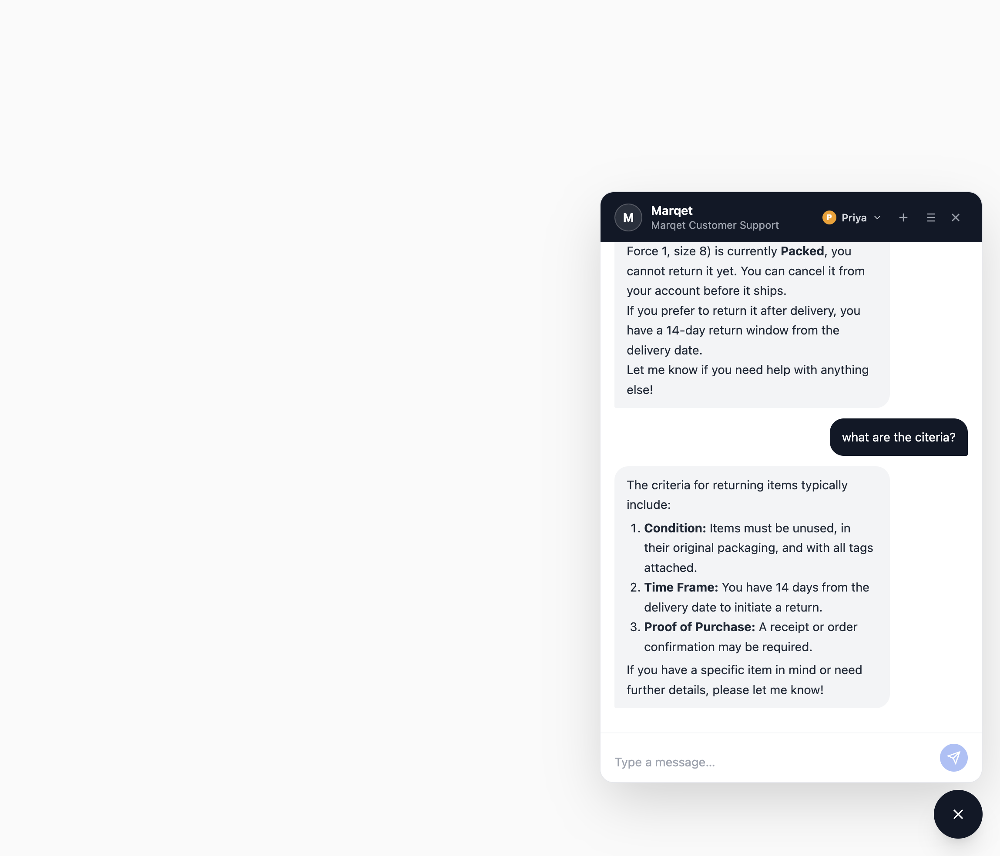

# Marqet AI Chat

A customer support chat widget for Marqet — a fictional Indian e-commerce marketplace. The AI agent knows Marqet's product catalog and policies through a RAG pipeline, tracks live order status via Supabase Realtime, and keeps separate conversation histories for each of five demo customers.

**Live demo:** [https://spur-ai-chat-five.vercel.app](https://spur-ai-chat-five.vercel.app)  
**Backend API:** [https://spur-ai-chat-vmie.onrender.com](https://spur-ai-chat-vmie.onrender.com) — health check: [`/health`](https://spur-ai-chat-vmie.onrender.com/health)

---



---

## What it does

- Answers questions about Marqet products, pricing, and policies using FAQ chunks embedded in pgvector + per-session conversation memory
- Shows live order status cards that update in real time without a page refresh (Supabase Realtime WebSocket)
- Supports multiple independent chat sessions per customer — switch between them, delete old ones, history survives reload
- Recognises natural order queries like "my orders", "what did I buy", and "show my purchases"
- Lets you browse as any of 5 demo customers (Priya, Arjun, Sneha, Divya, Karan); the AI knows who it's talking to and won't leak another customer's data
- Blocks identity spoofing — if someone types "my name is Priya" mid-session as a different customer, the AI rejects the claim
- Prevents hallucinated orders by injecting the customer's actual order list into every prompt

---

## Stack

| Layer | Technology |
|---|---|
| Backend | Node.js + TypeScript + Express |
| Frontend | React + Vite + TypeScript + Tailwind CSS |
| Database | Supabase (PostgreSQL + pgvector + Realtime) |
| LLM | OpenAI gpt-4o-mini |
| Embeddings | OpenAI text-embedding-3-small (1536 dims) |
| Deployment | Render (backend) + Vercel (frontend) |

---

## Local Setup

### Prerequisites

- Node.js 18+
- A [Supabase](https://supabase.com) project with pgvector enabled
- An OpenAI API key

### 1. Clone and install

```bash
git clone https://github.com/shivam-tamboli/spur-ai-chat.git
cd spur-ai-chat

cd backend && npm install
cd ../frontend && npm install
```

### 2. Environment variables

**Backend** (`backend/.env`):

```
OPENAI_API_KEY=sk-...
SUPABASE_URL=https://your-project.supabase.co
SUPABASE_SERVICE_ROLE_KEY=eyJ...
SUPABASE_ANON_KEY=eyJ...
PORT=3001
NODE_ENV=development
CORS_ORIGIN=http://localhost:5173
SUPPORT_EMAIL=support@marqet.com
SUPPORT_PHONE=+91-9999999999
```

**Frontend** (`frontend/.env`):

```
VITE_API_BASE_URL=http://localhost:3001
VITE_SUPABASE_URL=https://your-project.supabase.co
VITE_SUPABASE_ANON_KEY=eyJ...
```

### 3. Run Supabase migrations

Run these in order from your Supabase dashboard → SQL editor (or `supabase db push`):

```
001_init.sql
002_vector_search_functions.sql
003_session_isolated_embeddings.sql
004_marqet_status_rename.sql
005_fix_order_customer_mapping.sql
006_add_card_payloads_column.sql
007_add_customers_table.sql
008_embedding_not_null_and_indexes.sql
009_customer_slug.sql
010_remove_slug_use_uuid.sql
```

> Real-time order tracking requires the `orders` table to be in the Supabase Realtime publication:
> ```sql
> SELECT pubname, tablename FROM pg_publication_tables WHERE tablename = 'orders';
> -- If no rows: ALTER PUBLICATION supabase_realtime ADD TABLE orders;
> ```

### 4. Start the backend

```bash
cd backend && npm run dev
```

First run seeds the database automatically — 38 FAQ chunks with embeddings and 7 mock orders (MQ-1001 through MQ-1007). Both steps are skipped if the data already exists.

```bash
# To re-seed manually:
npm run seed:faq     # re-embeds FAQ chunks (calls OpenAI)
npm run seed:orders  # re-inserts mock orders
```

### 5. Start the frontend

```bash
cd frontend && npm run dev
```

Open `http://localhost:5173`.

---

## API

### POST /chat/message

Send a message and get a reply.

**Request body:**
```json
{
  "message": "my orders?",
  "sessionId": "29080d20-e8f5-41c1-a291-12d5428e7a52",
  "customerId": "8768f042-f13b-43bb-8d9d-01843a520a2d"
}
```

**Response:**
```json
{
  "reply": "Sure, Priya! Here are your current orders:\n\n1. **MQ-1001** — Nike Air Force 1 (size 8) — Packed\n2. **MQ-1005** — Apple AirPods Pro (2nd gen) — Shipped (3–5 business days)",
  "sessionId": "29080d20-e8f5-41c1-a291-12d5428e7a52",
  "card_payloads": [
    {
      "type": "order",
      "order_number": "MQ-1001",
      "status": "Packed",
      "customer_name": "Priya Sharma",
      "items": [{ "name": "Nike Air Force 1", "qty": 1, "size": "8" }]
    },
    {
      "type": "order",
      "order_number": "MQ-1005",
      "status": "Shipped",
      "customer_name": "Priya Sharma",
      "items": [{ "name": "Apple AirPods Pro (2nd gen)", "qty": 1 }]
    }
  ]
}
```

### GET /chat/:sessionId/messages

Fetch the full message history for a session.

**Sample response:**
```json
[
  {
    "id": "dc72115d-e8d7-4351-a9a8-166ceac563c3",
    "conversation_id": "29080d20-e8f5-41c1-a291-12d5428e7a52",
    "sender": "user",
    "text": "hi",
    "card_payload": null,
    "card_payloads": null,
    "timestamp": "2026-06-08T16:33:43.349862+00:00"
  },
  {
    "id": "ea75ce2f-d3dc-4ae2-add2-38880a351161",
    "conversation_id": "29080d20-e8f5-41c1-a291-12d5428e7a52",
    "sender": "ai",
    "text": "Hello, Priya! How can I assist you today? Would you like to see your orders, or is there something else you need help with?",
    "card_payload": null,
    "card_payloads": null,
    "timestamp": "2026-06-08T16:33:46.934947+00:00"
  },
  {
    "id": "fea10c28-5bc9-4d4e-87a7-b7103bf814e9",
    "conversation_id": "29080d20-e8f5-41c1-a291-12d5428e7a52",
    "sender": "ai",
    "text": "Sure, Priya! Here are your current orders:\n\n1. **Order ID:** MQ-1001\n   - **Status:** Packed\n   - **Item:** Nike Air Force 1 (size 8)\n\n2. **Order ID:** MQ-1005\n   - **Status:** Shipped\n   - **Item:** Apple AirPods Pro (2nd gen)\n   - **Estimated Delivery:** 3–5 business days",
    "card_payload": {
      "type": "order",
      "order_number": "MQ-1001",
      "status": "Packed",
      "customer_name": "Priya Sharma",
      "items": [{ "name": "Nike Air Force 1", "qty": 1, "size": "8" }]
    },
    "card_payloads": [
      {
        "type": "order",
        "order_number": "MQ-1001",
        "status": "Packed",
        "customer_name": "Priya Sharma",
        "items": [{ "name": "Nike Air Force 1", "qty": 1, "size": "8" }]
      },
      {
        "type": "order",
        "order_number": "MQ-1005",
        "status": "Shipped",
        "customer_name": "Priya Sharma",
        "items": [{ "name": "Apple AirPods Pro (2nd gen)", "qty": 1 }]
      }
    ],
    "timestamp": "2026-06-08T16:34:36.834309+00:00"
  },
  {
    "id": "477fa8c4-af80-4682-9238-ea1161474270",
    "conversation_id": "29080d20-e8f5-41c1-a291-12d5428e7a52",
    "sender": "ai",
    "text": "The criteria for returning items typically include:\n\n1. **Condition:** Items must be unused, in their original packaging, and with all tags attached.\n2. **Time Frame:** You have 14 days from the delivery date to initiate a return.\n3. **Proof of Purchase:** A receipt or order confirmation may be required.",
    "card_payload": null,
    "card_payloads": null,
    "timestamp": "2026-06-08T16:37:51.544023+00:00"
  }
]
```

### DELETE /chat/:sessionId

Delete a session and cascade through its messages and embeddings.

### GET /orders/:orderNumber

Look up a single order by number (e.g. `MQ-1001`).

### POST /orders/:orderNumber/advance

Advance an order through its lifecycle: `Paid → Packed → Shipped → Delivered`. Triggers a Supabase Realtime event so any open order card updates immediately.

```bash
# Local (no auth needed)
curl -X POST http://localhost:3001/orders/MQ-1001/advance

# Production
curl -X POST https://spur-ai-chat-vmie.onrender.com/orders/MQ-1001/advance \
  -H "x-admin-key: YOUR_DEMO_ADMIN_KEY"
```

---

## Environment Variables

| Variable | Where | Description |
|---|---|---|
| `OPENAI_API_KEY` | backend | Chat completions + embeddings |
| `SUPABASE_URL` | backend + frontend | Supabase project URL |
| `SUPABASE_SERVICE_ROLE_KEY` | backend | Full DB access for server-side writes |
| `SUPABASE_ANON_KEY` | backend + frontend | Realtime subscription (frontend) |
| `PORT` | backend | HTTP port, default 3001 |
| `NODE_ENV` | backend | Set to `production` on Render |
| `CORS_ORIGIN` | backend | Allowed frontend origin in production |
| `SUPPORT_EMAIL` | backend | Injected into escalation replies |
| `SUPPORT_PHONE` | backend | Injected into escalation replies |
| `DEMO_ADMIN_KEY` | backend | Guards `/orders/:num/advance` in production |
| `VITE_API_BASE_URL` | frontend | Backend base URL |
| `VITE_SUPABASE_URL` | frontend | Supabase URL for Realtime client |
| `VITE_SUPABASE_ANON_KEY` | frontend | Anon key for Realtime client |

---

## How a message gets processed

When you send a message, the backend runs three things in sequence before replying:

1. **Order intent detection** — checks for `MQ-XXXX` patterns and natural phrases like "my orders". Each match hits the DB, runs a `customerOwns()` ownership check, and injects the result as tagged context (e.g. `ORDER_FOUND`, `MY_ORDERS_FOUND`, `ORDER_BELONGS_TO_OTHER`).

2. **RAG retrieval** — embeds the user message and pulls the top 3 matching FAQ chunks plus top 3 from the session's message history (cosine similarity via pgvector). These go into the system prompt alongside the order context.

3. **LLM completion** — `gpt-4o-mini` generates the reply with full context. Structured order cards are parsed out and returned alongside the text so the frontend can render them as interactive status cards.

Full detail in [ARCHITECTURE.md](./ARCHITECTURE.md).

---

## Sessions

No login required. Each session is a UUID stored in localStorage, scoped per customer so switching customers doesn't mix up history.

- Hit **+** in the header to start a fresh session (no DB row until the first message)
- The session list icon shows all past sessions with a preview of the first message
- Deleting a session cascades through messages and their embeddings on the backend
- RAG memory is scoped to the active session — two conversations about different topics don't bleed into each other

---

## LLM setup

- **Model:** `gpt-4o-mini` — good balance of speed and quality for support chat
- **Context:** last 20 messages + up to 6 RAG chunks (3 FAQ + 3 session history) per turn
- **Embeddings:** `text-embedding-3-small` (1536 dims), stored async after each message
- **Temperature:** 0.4, max 512 tokens per reply

---

## Key design choices

| Choice | Why |
|---|---|
| Supabase for everything | Postgres + pgvector + Realtime in one place, free tier |
| gpt-4o-mini | ~10x cheaper than GPT-4o, fast enough for support chat |
| Dual RAG stores | FAQ for product/policy knowledge, message embeddings for conversational memory |
| UUID as customer identifier | Sent directly over the wire; backend resolves to display name server-side so PII never crosses the network |
| `customerOwns()` on every order lookup | Cross-customer data never reaches the LLM, even if someone guesses an order number |
| `ORDERS_FOR_CUSTOMER` on every turn | LLM always knows the real order list and can reject phantom order claims |
| Fire-and-forget embeddings | Doesn't block the response; slightly degraded RAG recall on failure is acceptable |
| Order cards via regex | Avoids an extra LLM call for `MQ-XXXX` detection |

---

## What's next

A few things worth adding before this goes to real production:

- **Auth** — right now sessions are device-local. Supabase Auth would tie them to real accounts.
- **Streaming** — server-sent events so the reply appears word-by-word instead of all at once.
- **Tool-calling** — replace the regex order detection with proper function calls so the LLM can trigger cancel/refund actions with a confirmation step.
- **OpenTelemetry** — the structured logger is a good start, but proper traces would expose per-request latency breakdowns (RAG vs LLM vs DB) in a dashboard.
- **RAG eval pipeline** — validate retrieval quality across three axes: *recall* (did the right FAQ chunks come back?), *correctness* (is the answer factually right against the source?), and *faithfulness* (did the LLM actually use what was retrieved, or did it hallucinate past it?). A fixed Q&A golden set run nightly would catch regressions whenever chunks are edited or the similarity threshold is tuned.
- **Embedding job queue** — move fire-and-forget to a retryable queue so embedding failures don't silently degrade RAG recall.
